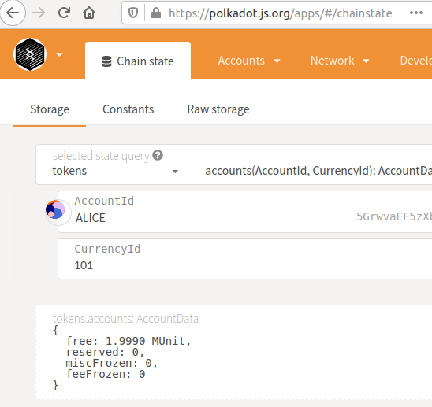
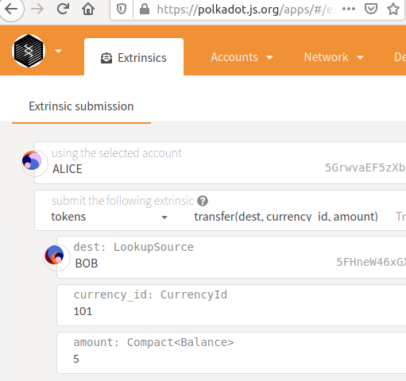
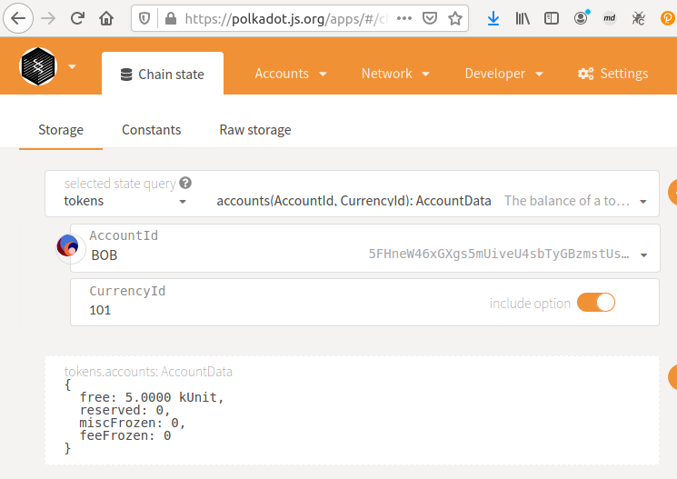

[[ECOSYSTEM CHALLENGE] Enable Multi-Currency Support | AcalaNetwork Funded Issue Detail | Gitcoin | Gitcoin](https://gitcoin.co/issue/AcalaNetwork/polakdot-hello-world-acala/2/100023952)

# Submission

Runtime: [helloworld-dot/orml-token/orml-token-node/runtime at main · y12studio/helloworld-dot](https://github.com/y12studio/helloworld-dot/tree/main/orml-token/orml-token-node/runtime)

pallet-template: mint token 101

orml-token pallet: query token 101

transfer token 101

query token 101

